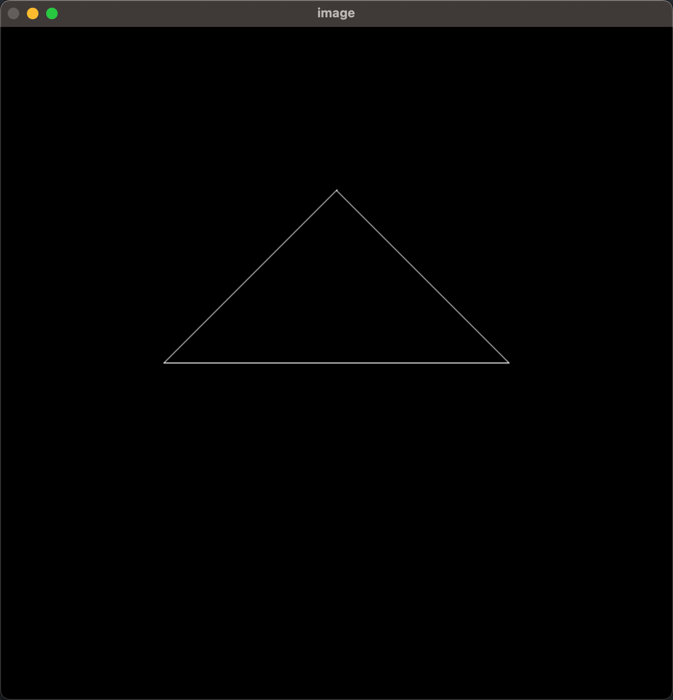
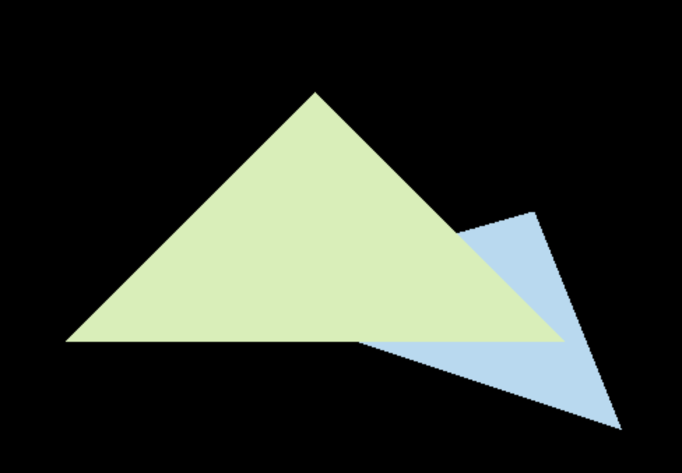

# Games 101 / 202  implementation of the course project

## 101 

> 2024 中秋 想把 games101 补一下，熟悉一下 cpp 和 图形学的基础知识

### 变换
target: 绘制一个三角形

key points:
* 绕 Z 轴旋转 和 绕任意轴旋转
* 推导有 \(eye_fov,aspect, zNear, zFar\) 后，得到正交投影矩阵 -> 透视投影矩阵

### Raster 光栅化

target: 绘制一个有深度和颜色的三角形

key points:
* Bounding Box 减少计算量
* 计算像素是否在三角形内部
* 使用线性插值，计算 Z buffer 中 Z 值，并且填充 Z buffer 进行绘制
* super-sampling 抗锯齿 ， MSAA 多重采样 [TODO]

